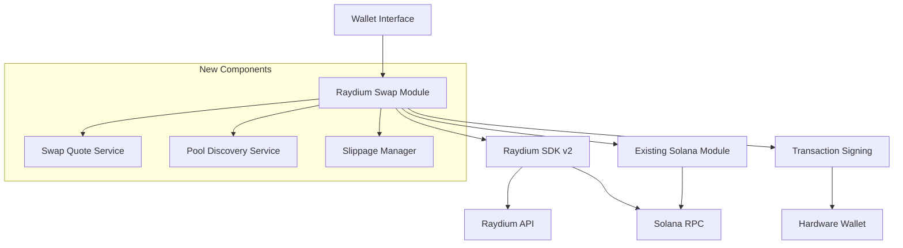

# Design Document - Raydium Swap Integration

## Overview

This design document outlines the implementation of Raydium DEX swap functionality for the existing wallet system. The solution will integrate with the current architecture while adding new capabilities for token swapping on the Solana blockchain using the @raydium-io/raydium-sdk-v2.

The implementation will extend the existing `deeperWallet/solana.js` module and follow the established patterns for transaction handling, error management, and user interaction.

## Architecture

### High-Level Architecture



### Integration Points

1. **Existing Solana Module**: Extend `deeperWallet/solana.js` with new swap functions
2. **Transaction Signing**: Leverage existing hardware wallet signing infrastructure
3. **Error Handling**: Use established error handling patterns from existing modules
4. **Network Configuration**: Utilize existing RPC URL management system

## Components and Interfaces

### 1. Raydium Swap Service

**Location**: `deeperWallet/raydium.js` (new file)

**Core Functions**:
```javascript
// Initialize Raydium SDK instance
async function initializeRaydium(network, ownerAddress)

// Get swap quote for token pair
async function getSwapQuote(inputMint, outputMint, amountIn, slippage)

// Execute swap transaction
async function executeSwap(password, fromAddress, swapParams, network)

// Get available pools for token pair
async function getPoolsForPair(mint1, mint2)

// Validate token pair compatibility
async function validateTokenPair(inputMint, outputMint, network)
```

### 2. Pool Discovery Service

**Purpose**: Find and validate Raydium pools for token pairs

**Key Methods**:
```javascript
// Find best pool for swap
async function findBestPool(inputMint, outputMint, amountIn)

// Get pool information by ID
async function getPoolInfo(poolId)

// Check pool liquidity and status
async function validatePoolLiquidity(poolId, requiredLiquidity)
```

### 3. Quote Calculation Service

**Purpose**: Calculate swap quotes with accurate pricing and fees

**Key Methods**:
```javascript
// Calculate output amount for given input
async function calculateSwapOutput(poolInfo, amountIn, slippage)

// Get current market price and impact
async function getMarketData(inputMint, outputMint)

// Calculate fees and final amounts
async function calculateFees(poolInfo, amountIn)
```

### 4. Slippage Management

**Purpose**: Handle slippage tolerance and price protection

**Configuration**:
```javascript
const SLIPPAGE_CONFIG = {
  DEFAULT: 1.0,    // 1%
  MIN: 0.1,        // 0.1%
  MAX: 50.0,       // 50%
  WARNING_THRESHOLD: 5.0  // 5%
}
```

### 5. Extended Solana Module

**Additions to `deeperWallet/solana.js`**:
```javascript
// Import Raydium functionality
const raydium = require('./raydium');

// New export functions
module.exports = {
  // ... existing exports
  getSwapQuote: raydium.getSwapQuote,
  executeRaydiumSwap: raydium.executeSwap,
  getAvailablePools: raydium.getPoolsForPair,
  validateSwapTokens: raydium.validateTokenPair
};
```

## Data Models

### 1. Swap Quote Model

```javascript
const SwapQuote = {
  inputMint: String,           // Input token mint address
  outputMint: String,          // Output token mint address
  inputAmount: String,         // Input amount in smallest units
  outputAmount: String,        // Expected output amount
  minimumOutputAmount: String, // Minimum output with slippage
  priceImpact: Number,        // Price impact percentage
  fee: String,                // Transaction fee
  slippage: Number,           // Applied slippage percentage
  poolId: String,             // Selected pool ID
  route: Array,               // Swap route information
  timestamp: Number,          // Quote timestamp
  expiresAt: Number          // Quote expiration time
};
```

### 2. Pool Information Model

```javascript
const PoolInfo = {
  id: String,                 // Pool unique identifier
  name: String,               // Pool name (e.g., "SOL-USDC")
  mintA: String,              // Token A mint address
  mintB: String,              // Token B mint address
  liquidity: String,          // Total liquidity
  volume24h: String,          // 24h trading volume
  fee: Number,                // Pool fee percentage
  apy: Number,                // Annual percentage yield
  status: String,             // Pool status (active, inactive)
  reserves: {
    tokenA: String,
    tokenB: String
  }
};
```

### 3. Swap Transaction Model

```javascript
const SwapTransaction = {
  signature: String,          // Transaction signature
  inputMint: String,          // Input token mint
  outputMint: String,         // Output token mint
  inputAmount: String,        // Actual input amount
  outputAmount: String,       // Actual output amount
  fee: String,                // Transaction fee paid
  slippage: Number,           // Applied slippage
  poolId: String,             // Used pool ID
  status: String,             // Transaction status
  timestamp: Number,          // Transaction timestamp
  blockHeight: Number         // Block height when confirmed
};
```

## Error Handling

### Error Categories

1. **Network Errors**
   - RPC connection failures
   - API timeout errors
   - Network congestion issues

2. **Validation Errors**
   - Invalid token addresses
   - Insufficient balance
   - Unsupported token pairs

3. **Pool Errors**
   - Pool not found
   - Insufficient liquidity
   - Pool temporarily disabled

4. **Transaction Errors**
   - Slippage exceeded
   - Transaction simulation failed
   - Signing errors

### Error Handling Strategy

```javascript
const ErrorHandler = {
  // Retry configuration for network errors
  RETRY_CONFIG: {
    maxRetries: 3,
    backoffMultiplier: 2,
    initialDelay: 1000
  },
  
  // Error classification and response
  classifyError(error) {
    // Classify error type and determine appropriate response
  },
  
  // Retry logic for recoverable errors
  async retryWithBackoff(operation, config) {
    // Implement exponential backoff retry logic
  }
};
```

### User-Friendly Error Messages

```javascript
const ERROR_MESSAGES = {
  INSUFFICIENT_BALANCE: "Insufficient balance for this swap",
  SLIPPAGE_EXCEEDED: "Price moved too much. Try increasing slippage tolerance",
  POOL_NOT_FOUND: "No liquidity pool found for this token pair",
  NETWORK_ERROR: "Network connection issue. Please try again",
  INVALID_TOKEN: "Invalid token address provided",
  TRANSACTION_FAILED: "Transaction failed. Please check your settings and try again"
};
```

## Testing Strategy

### 1. Unit Testing

**Test Coverage Areas**:
- Quote calculation accuracy
- Pool discovery logic
- Error handling scenarios
- Input validation
- Slippage calculations

**Test Framework**: Jest or similar testing framework

**Mock Strategy**:
- Mock Raydium SDK responses
- Mock Solana RPC calls
- Mock hardware wallet signing

### 2. Integration Testing

**Test Scenarios**:
- End-to-end swap execution on devnet
- Pool discovery with real data
- Error handling with network issues
- Transaction signing flow

**Test Environment**: Solana Devnet

### 3. Error Scenario Testing

**Critical Test Cases**:
- Network disconnection during swap
- Insufficient balance scenarios
- Slippage tolerance exceeded
- Pool liquidity changes during transaction
- Hardware wallet signing failures

### 4. Performance Testing

**Metrics to Monitor**:
- Quote calculation time
- Pool discovery performance
- Transaction confirmation time
- Memory usage during operations

## Security Considerations

### 1. Input Validation

- Validate all token mint addresses
- Sanitize user input amounts
- Verify slippage tolerance ranges
- Check for malicious pool addresses

### 2. Transaction Security

- Simulate transactions before signing
- Verify transaction contents match user intent
- Implement maximum slippage limits
- Add transaction amount confirmations

### 3. Private Key Protection

- Never expose private keys in logs
- Use existing secure signing infrastructure
- Implement secure key derivation
- Add additional confirmation for large amounts

### 4. API Security

- Rate limiting for API calls
- Secure RPC endpoint usage
- Input sanitization for all external calls
- Timeout handling for all network requests

## Implementation Phases

### Phase 1: Core Infrastructure
- Set up Raydium SDK integration
- Implement basic pool discovery
- Create quote calculation service
- Add error handling framework

### Phase 2: Swap Execution
- Implement transaction building
- Add hardware wallet signing integration
- Create transaction monitoring
- Add basic testing

### Phase 3: Advanced Features
- Add slippage management
- Implement retry logic
- Add comprehensive error handling
- Create performance optimizations

### Phase 4: Testing and Validation
- Comprehensive unit testing
- Integration testing on devnet
- Error scenario testing
- Performance validation

## Configuration

### Environment Variables

```javascript
const CONFIG = {
  RAYDIUM_API_ENDPOINT: process.env.RAYDIUM_API_ENDPOINT || 'https://api.raydium.io',
  DEFAULT_SLIPPAGE: parseFloat(process.env.DEFAULT_SLIPPAGE) || 1.0,
  MAX_SLIPPAGE: parseFloat(process.env.MAX_SLIPPAGE) || 50.0,
  QUOTE_REFRESH_INTERVAL: parseInt(process.env.QUOTE_REFRESH_INTERVAL) || 30000,
  TRANSACTION_TIMEOUT: parseInt(process.env.TRANSACTION_TIMEOUT) || 60000
};
```

### Network Configuration

```javascript
const NETWORK_CONFIG = {
  'SOLANA': {
    rpcUrl: 'https://api.mainnet-beta.solana.com',
    raydiumProgramId: '675kPX9MHTjS2zt1qfr1NYHuzeLXfQM9H24wFSUt1Mp8'
  },
  'SOLANA-DEVNET': {
    rpcUrl: 'https://api.devnet.solana.com',
    raydiumProgramId: '675kPX9MHTjS2zt1qfr1NYHuzeLXfQM9H24wFSUt1Mp8'
  }
};
```

## Monitoring and Logging

### Logging Strategy

```javascript
const LOG_LEVELS = {
  ERROR: 'error',
  WARN: 'warn', 
  INFO: 'info',
  DEBUG: 'debug'
};

// Log important events
logger.info('Swap quote requested', { inputMint, outputMint, amount });
logger.warn('High slippage detected', { slippage, threshold });
logger.error('Swap execution failed', { error, transactionId });
```

### Metrics Collection

- Swap success/failure rates
- Average quote calculation time
- Pool discovery performance
- Transaction confirmation times
- Error frequency by type